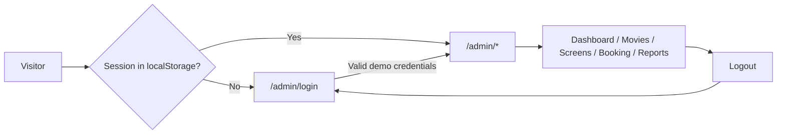

# DatabaseWeb — Cinema Admin (Client)

The **React + TypeScript** frontend for **DatabaseWeb**: a **cinema / theater operations console** you can walk through end-to-end in the browser. Staff-style flows include a dashboard, movie catalog, screen timelines and showtimes, bookings, and reporting charts—wrapped in a single **admin shell** (sidebar, contextual top bar, logout).

This package is intentionally **self-contained**: business data lives in **seed modules** under `src/store/temp*.ts`, and **authentication is a client-side demo** (Zustand + `localStorage`). There is **no API or database bundled here**—useful for coursework, portfolio demos, or as the UI layer you later connect to a real backend.

---

## Table of contents

1. [Showcase — what we built](#showcase--what-we-built)
2. [Product tour (by route)](#product-tour-by-route)
3. [Architecture at a glance](#architecture-at-a-glance)
4. [Tech stack](#tech-stack)
5. [Prerequisites](#prerequisites)
6. [Setup and npm scripts](#setup-and-npm-scripts)
7. [Run the app](#run-the-app)
8. [Routing and navigation](#routing-and-navigation)
9. [Authentication (demo)](#authentication-demo)
10. [UI shell, themes, and styling](#ui-shell-themes-and-styling)
11. [State and data](#state-and-data)
12. [Project structure](#project-structure)
13. [Configuration files](#configuration-files)
14. [Production build and hosting](#production-build-and-hosting)
15. [Extending toward a real backend](#extending-toward-a-real-backend)
16. [Troubleshooting](#troubleshooting)
17. [License / course context](#license--course-context)

---

## Showcase — what we built

### Elevator pitch

A **fully navigable cinema admin SPA**: log in, land on a KPI-style dashboard with a weekly booking trend, manage a **paginated movie catalog** with posters and modals, plan showtimes on a **10:00–22:00 day timeline** per theater and screen, review **paginated bookings** with status filters, and explore **Recharts**-powered reports—all behind a simple **route guard** and a consistent **light / dark** visual system per section.

### Highlights

| Area | What you get |
|------|----------------|
| **Admin shell** | `NavSidebar`, `Topbar` with page title and logout; main area switches **light theme** (Dashboard, Reports) vs **dark theme** (Movies, Screens, Booking) via `AdminPageLayout`. |
| **Dashboard** | Status cards, **line chart** (weekly booking trend), “Upcoming Showtimes” table. |
| **Movie management** | Card grid with poster, genre, duration, **Active** badge; **Add** and **Edit** via `MovieFormModal`; row actions (edit, **schedule** → navigates to Screens, delete). Paginated (**4** cards per page). |
| **Screen management** | Theater tabs, screen selector, **hourly timeline** with colored showtime blocks; add/edit via `ScreenFormModal` (movie, language, format, date, time window, seat plan, price label). |
| **Booking** | Table with **Confirmed / Pending / Cancelled** filters, status badges, **View** affordance for payment proof; pagination (**6** rows per page). |
| **Reports** | Time range, report type, and “filter by” controls; summary stats; **area** (revenue trend) and **bar** (monthly) charts. |
| **Auth (demo)** | `useAuth` store with ~800ms simulated login; only `authed` is persisted. |
| **Single config for nav** | Paths, labels, titles, **light/dark top bar colors**, and sidebar icons come from `ADMIN_PATH_CONFIG` in `UrlPathConfig.ts`. |

### User journey



### Screenshot ideas (for presentations)

Drop images under e.g. `docs/screenshots/` and link them here:

- Login and 404 (shared background imagery).
- Dashboard: cards + line chart + upcoming showtimes.
- Movies: card grid and modal.
- Screens: timeline with blocks.
- Booking table and Reports charts.

---

## Product tour (by route)

| URL | Page | Notes |
|-----|------|--------|
| `/admin/login` | Login | Full-screen card; invalid attempts show inline error. |
| `/admin` or `/admin/` | Dashboard | Default landing after login; light surface theme. |
| `/admin/movies` | Movie management | Dark theme; seed list in `tempMoiveData.ts` (filename spelling). |
| `/admin/screens` | Screen management | Timeline `HOUR_START`–`HOUR_END` (10–22) from `ScreenManagement.tsx`; data shaped in `tempScreenData.ts`. |
| `/admin/booking` | Booking | Filters + pagination; `tempBookingData.ts`. |
| `/admin/reports` | Reports | Charts read `tempReportdata.ts`. |
| `*` | NotFound | Links back to admin home and login. |

**Not routed:** `src/pages/moveInspire.tsx` is an alternate / experimental movie UI. It is **not** registered in `App.tsx`; open it in the editor or add a `Route` if you want it in the app.

---

## Architecture at a glance

- **Entry:** `main.tsx` mounts the app with `StrictMode`, **`BrowserRouter`**, and global `index.css`.
- **Routes:** `App.tsx` defines all routes. Nested routes under `/admin` render inside `AdminPageLayout` via `<Outlet />`.
- **Guards:**
  - **`AdminProtectedRoute`** — if not `authed`, redirect to `/admin/login`.
  - **`AdminPagePlubishedRoutes`** (spelling as in source) — if already `authed`, visiting `/admin/login` redirects to `/admin/`.
- **Path normalization:** `resolveAdminPathKey()` maps `/admin` → `/admin/` so the dashboard entry matches `ADMIN_PATH_CONFIG`.

---

## Tech stack

| Layer | Choice |
|--------|--------|
| Runtime | **Node.js** 20+ recommended |
| UI | **React 19** |
| Language | **TypeScript** (~6.x) |
| Bundler | **Vite 8** |
| Routing | **React Router 7** |
| Styling | **Tailwind CSS 4** (`@tailwindcss/vite`) |
| Charts | **Recharts 3** |
| Client state | **Zustand 5** (`persist` for auth) |

**Import alias:** `@/*` → `src/*` (see `vite.config.ts` and `tsconfig.app.json`).

---

## Prerequisites

- **Node.js** 20 or newer (recommended for Vite 8 and current tooling).
- **npm** (this repo uses `package-lock.json`).

---

## Setup and npm scripts

From the **`client`** directory:

```bash
cd client
npm install
```

| Script | What it does |
|--------|----------------|
| `npm run dev` | Vite dev server — default [http://localhost:5173](http://localhost:5173) |
| `npm run build` | `tsc -b` then production output to `dist/` |
| `npm run preview` | Serve the production build locally (smoke test) |
| `npm run lint` | ESLint with flat config (`eslint.config.js`) |

---

## Run the app

1. `npm install` then `npm run dev`.
2. Open the printed local URL (typically port **5173**).
3. Go to **`/admin/login`** (or navigate from 404 links).
4. Sign in with a [demo account](#authentication-demo).
5. Use the sidebar to move between modules.

---

## Routing and navigation

| Path | Behavior |
|------|----------|
| `/admin/login` | Login; wrapped so authenticated users are sent to `/admin/`. |
| `/admin` | Parent layout: sidebar + top bar + outlet. |
| `/admin/`, `/admin/movies`, … | Child routes rendered inside `AdminPageLayout`. |
| Anything else | `NotFound` (404). |

**Adding a new admin page:** register a `Route` under the `/admin` parent in `App.tsx`, append an entry to `ADMIN_PATH_CONFIG` in `UrlPathConfig.ts` (path, title, label, `colorSet`, icon via `iconPath("filename")` matching `src/assets/navbar/filename.png`), and create the page component under `src/pages/`.

---

## Authentication (demo)

- **Implementation:** `src/store/useAuth.ts` — Zustand + `persist`; only `{ authed }` is stored.
- **Storage key:** `cinema-admin-auth`.
- **Login:** email + password checked against an in-memory list after a short delay (simulated API).

**Demo accounts** (change in `useAuth.ts` for your environment):

| Email | Password |
|--------|-----------|
| `test` | `test` |
| `admin@cinema.com` | `admin123` |

This is **not** production-grade security. For real deployments, use HTTPS, server-side verification, and cookies or tokens issued by your API.

---

## UI shell, themes, and styling

- **`AdminPageLayout`** sets the main column background from `ADMIN_PATH_CONFIG` and exposes `data-admin-theme="light"` or `"dark"` for Dashboard/Reports vs Movies/Screens/Booking.
- **Design tokens** live in `src/index.css` (`:root` CSS variables): surfaces, top bar, sidebar, text, charts, pagination, inputs. Prefer editing tokens there rather than scattering hex values.
- **Tailwind:** `@import "tailwindcss"` and utility classes; chart components use CSS variables for grid/axis/tooltip colors so they track the theme.
- **Sidebar icons:** PNGs in `src/assets/navbar/`, resolved by `import.meta.glob` in `UrlPathConfig.ts`. File names must match `iconPath("name")` calls.
- **Login / 404 background:** `src/assets/login_bg.png` — referenced from `Login.tsx` and `NotFound.tsx`.

---

## State and data

| Concern | Where |
|---------|--------|
| Login session | `useAuthStore` in `store/useAuth.ts` |
| Dashboard | `store/tempDashboardData.ts` |
| Movies | `store/tempMoiveData.ts` |
| Screens / showtimes | `store/tempScreenData.ts` |
| Bookings | `store/tempBookingData.ts` |
| Reports | `store/tempReportdata.ts` |

Page components generally **import** these modules and keep **local UI state** (pagination index, filters, modal open state) in `useState`. There is no global entity store for movies or bookings—updates follow the patterns inside each page (e.g. copying and replacing arrays after modal submit).

---

## Project structure

```
client/
  index.html
  vite.config.ts
  eslint.config.js
  tsconfig.json
  tsconfig.app.json
  tsconfig.node.json
  vercel.json                 # SPA fallback rewrites (optional; see hosting)
  package.json
  src/
    main.tsx                  # createRoot, BrowserRouter, index.css
    App.tsx                   # Routes + auth wrappers
    index.css                 # Tailwind + design tokens
    assets/
      login_bg.png            # Optional; wire in Login / NotFound if used
      navbar/*.png            # Sidebar icons
    components/
      AdminPageLayout.tsx
      NavSidebar.tsx
      Topbar.tsx
      UrlPathConfig.ts        # ADMIN_PATH_CONFIG, resolveAdminPathKey, icons
      editModal/
        MovieFormModal.tsx
        ScreenFormModal.tsx
    pages/
      Login.tsx
      Dashboard.tsx
      MovieManagement.tsx
      ScreenManagement.tsx
      Booking.tsx
      Report.tsx
      NotFound.tsx
      moveInspire.tsx         # Not in App routes by default
    store/
      useAuth.ts
      tempDashboardData.ts
      tempMoiveData.ts
      tempScreenData.ts
      tempBookingData.ts
      tempReportdata.ts
```

---

## Configuration files

| File | Role |
|------|------|
| `vite.config.ts` | React plugin, Tailwind Vite plugin, `@` → `./src` |
| `tsconfig.json` | References app + node configs |
| `tsconfig.app.json` | Strict TS, `paths` for `@/*` |
| `eslint.config.js` | TypeScript ESLint, React Hooks, React Refresh |
| `index.html` | `#root`, favicon, document `<title>` (customize for production) |

---

## Production build and hosting

```bash
npm run build
```

Output: **`dist/`** — static HTML/JS/CSS.

Because the app uses **`BrowserRouter`**, the host must serve **`index.html` for unknown paths** (SPA fallback) so deep links like `/admin/movies` work on refresh.

This repo includes **`vercel.json`** with a catch-all rewrite to `index.html`, suitable for **Vercel** or similar platforms that respect the same config shape.

---

## Extending toward a real backend

1. Introduce a backend (REST, GraphQL, tRPC, etc.) and a database.
2. Replace `temp*.ts` imports with **`fetch`**, a generated client, or your SDK; consider **TanStack Query** (or similar) for caching and loading/error states.
3. Swap `useAuth` for real login (HTTP-only cookies or stored tokens with clear refresh/expiry rules).
4. Add **`import.meta.env.VITE_*`** variables for API base URLs and environment-specific flags; document them for your team.

---

## Troubleshooting

| Issue | What to try |
|-------|-------------|
| `npm install` fails | Use Node 20+; remove `node_modules` and reinstall if the lockfile was produced on another OS/arch. |
| Missing background image | Add `src/assets/login_bg.png` or update imports in `Login.tsx` / `NotFound.tsx`. |
| Blank page on refresh for `/admin/...` | Enable SPA history fallback (see [Production build](#production-build-and-hosting)). |
| Wrong or missing sidebar icon | Ensure `src/assets/navbar/<name>.png` exists and matches `iconPath("<name>")` in `UrlPathConfig.ts`. |
| TypeScript errors after edits | Run `npm run build` to surface `tsc -b` issues; fix strict null/typing at the call site. |

---

## License / course context

No license file is included in this folder by default; treat as private or course work unless your team or instructor specifies otherwise.
