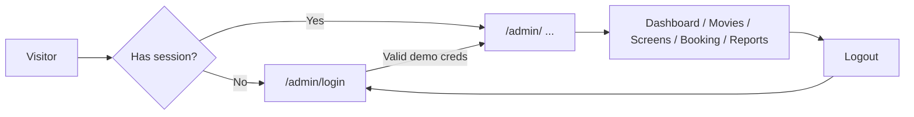

# DatabaseWeb — Cinema Admin (Client)

The **React frontend** for **DatabaseWeb**: a single-page **cinema / theater administration console**. Operators get a branded login, a unified shell with sidebar and top bar, and modules for dashboards, movies, screens and showtimes, bookings, and analytics-style reports.

This client is designed as a **fully navigable UI** with **seed data in TypeScript** (`src/store/temp*.ts`) and **browser-only demo authentication**. There is **no API or database in this package** yet—ideal for coursework, demos, or as the shell you later connect to a real backend.

---

## Table of contents

1. [Showcase — what we built](#showcase--what-we-built)
2. [Tech stack](#tech-stack)
3. [Prerequisites](#prerequisites)
4. [Setup & scripts](#setup--scripts)
5. [How to run and use the app](#how-to-run-and-use-the-app)
6. [Project structure](#project-structure)
7. [Feature guide (by page)](#feature-guide-by-page)
8. [Configuration files](#configuration-files)
9. [Production build & hosting](#production-build--hosting)
10. [Extending toward a real backend](#extending-toward-a-real-backend)
11. [Troubleshooting](#troubleshooting)
12. [License / course context](#license--course-context)

---

## Showcase — what we built

### At a glance

| Highlight | Description |
|-----------|-------------|
| **Admin shell** | Consistent layout: navigation, contextual top bar colors, logout. |
| **Dashboard** | KPI-style status cards, **Recharts** weekly booking trend, upcoming showtimes table. |
| **Movies** | Paginated catalog, posters, genres, actions; add/edit via modal. |
| **Screens** | Theater tabs, screen selection, **day timeline** (10:00–22:00) with showtime blocks; modal for scheduling. |
| **Bookings** | Filterable, paginated booking table with status and payment-proof affordances. |
| **Reports** | Filters, summary stats, **Recharts** area and bar charts from static datasets. |
| **Auth (demo)** | Zustand + `localStorage` persistence; redirects protect `/admin/*` except login. |

Styling uses **Tailwind CSS 4** with design tokens in `src/index.css` (e.g. `--color-topbar-light-bg`, `--color-surface-card`). **Navigation metadata** (paths, labels, titles, light/dark top bar sets, icons) lives in one place: `src/components/UrlPathConfig.ts`.

### User journey (high level)



### Screenshot placeholders

Add your own images here when presenting the project (e.g. `docs/screenshots/dashboard.png`):

- Login and 404 (shared visual language, background image).
- Dashboard with cards and chart.
- Movie management table and modal.
- Screen management timeline.
- Booking and reports.

---

## Tech stack

| Area | Choice |
|------|--------|
| Runtime (tooling) | **Node.js** 20+ recommended (current LTS) |
| UI | **React 19** |
| Language | **TypeScript** (~6.x) |
| Build / dev | **Vite 8** |
| Routing | **React Router 7** (`BrowserRouter` in `main.tsx`) |
| Styling | **Tailwind CSS 4** via `@tailwindcss/vite` |
| Charts | **Recharts 3** (Dashboard, Reports) |
| Client state | **Zustand 5** (auth + `persist` to `localStorage`) |

**Path alias:** `@/*` → `src/*` (see `vite.config.ts` and `tsconfig.app.json`).

---

## Prerequisites

- **Node.js** 20+ (Vite 8 and the toolchain expect a modern Node).
- **npm** (lockfile: `package-lock.json`).

---

## Setup & scripts

From the **`client`** directory:

```bash
cd client
npm install
```

| Command | Purpose |
|---------|---------|
| `npm run dev` | Vite dev server — default [http://localhost:5173](http://localhost:5173) |
| `npm run build` | `tsc -b` then production bundle to `dist/` |
| `npm run preview` | Serve the production build locally (smoke test) |
| `npm run lint` | ESLint (`eslint.config.js`, flat config) |

### Optional: assets

- **`src/assets/login_bg.png`** — Used by `Login.tsx` and `NotFound.tsx`. If missing, add the file or change the imports.
- **`src/assets/navbar/*.png`** — Sidebar icons; loaded via `import.meta.glob` in `UrlPathConfig.ts`.

---

## How to run and use the app

### Bootstrap

- **`src/main.tsx`** — `createRoot`, `StrictMode`, `BrowserRouter`, global `index.css`.
- **`src/App.tsx`** — Route table and auth wrappers.

### URLs

| Path | Behavior |
|------|----------|
| `/admin/login` | Login. If already authenticated → redirect to `/admin/`. |
| `/admin` or `/admin/` | Dashboard (nested under `AdminPageLayout`). |
| `/admin/movies` | Movie management. |
| `/admin/screens` | Screen / showtime timeline. |
| `/admin/booking` | Booking table (filters, pagination). |
| `/admin/reports` | Reports (charts + filters). |
| Anything else | `NotFound` (404) with links to admin and login. |

`resolveAdminPathKey()` in `UrlPathConfig.ts` maps `/admin` → `/admin/` so the dashboard entry matches `ADMIN_PATH_CONFIG`.

### Authentication (demonstration only)

- **Store:** `src/store/useAuth.ts` (Zustand + `persist`).
- **Not a real server login** — credentials are checked in the browser after a short delay.
- **Storage key:** `cinema-admin-auth` (only `authed` is persisted).

Demo accounts (change in `useAuth.ts` for your environment):

- `test` / `test`
- `admin@cinema.com` / `admin123`

**Wrappers in `App.tsx`:**

- `AdminProtectedRoute` — Unauthenticated users → `/admin/login`.
- `AdminPagePlubishedRoutes` (name as in source) — Authenticated users visiting login → `/admin/`.

For production, replace with a real API, HTTPS, and secure sessions or tokens.

### Layout

- **`AdminPageLayout`** — `NavSidebar`, `Topbar` (title from config, logout), `<Outlet />` for child routes.
- **Logout** sets `authed: false` (persist updates `localStorage`).

---

## Project structure

```
client/
  index.html
  vite.config.ts
  eslint.config.js
  tsconfig.json
  tsconfig.app.json
  tsconfig.node.json
  package.json
  src/
    main.tsx                 # Entry + BrowserRouter
    App.tsx                  # Routes + auth gates
    index.css                # Tailwind + CSS variables
    assets/                  # Images (login bg, navbar icons, etc.)
    components/
      AdminPageLayout.tsx    # Shell for /admin/* (except login)
      NavSidebar.tsx
      Topbar.tsx
      UrlPathConfig.ts       # Paths, titles, colors, icons
      editModal/
        MovieFormModal.tsx
        ScreenFormModal.tsx
    pages/
      Login.tsx
      Dashboard.tsx
      MovieManagement.tsx
      ScreenManagement.tsx
      Booking.tsx
      Report.tsx
      NotFound.tsx
      moveInspire.tsx        # Alternate / unused movie UI (not routed in App.tsx)
    store/
      useAuth.ts
      tempDashboardData.ts
      tempBookingData.ts
      tempReportdata.ts
      tempMoiveData.ts       # Note: filename spelling "Moive"
      tempScreenData.ts
```

---

## Feature guide (by page)

- **Dashboard** — Status cards; **Recharts** line chart (“Weekly Booking Trend”); “Upcoming Showtimes” table. Data: `tempDashboardData.ts`.
- **Movie management** — Paginated table (title, genre, duration, status), poster column, actions (edit / schedule / delete). **MovieFormModal** for add/edit. Seed: `tempMoiveData.ts`; list updates follow the in-page pattern (not a global entity store).
- **Screen management** — Theater tabs, screen dropdown, **timeline** 10:00–22:00 with colored blocks; **ScreenFormModal** (movie, language, format, screen, date, time, seat/price). Data: `tempScreenData.ts`.
- **Booking** — Status filters, paginated table, payment-proof column. Data: `tempBookingData.ts`.
- **Reports** — Time range and report-type controls, summary stats, **Recharts** area and bar charts. Data: `tempReportdata.ts`.
- **Login** — Full-screen card on background image.
- **404** — Same visual language; links to `/admin/` and `/admin/login`.
- **`moveInspire.tsx`** — Not registered in `App.tsx`; keep as a reference or wire a route if you want that layout in the app.

---

## Configuration files

| File | Role |
|------|------|
| `vite.config.ts` | React plugin, Tailwind Vite plugin, `@` → `./src` |
| `tsconfig.json` | References `tsconfig.app.json` and `tsconfig.node.json` |
| `tsconfig.app.json` | `ES2023`, DOM, strict checks, `paths` for `@/*` |
| `eslint.config.js` | TypeScript ESLint, React Hooks, React Refresh |
| `index.html` | Root `#root`, favicon, document title (currently `client` — rename for production if you like) |

---

## Production build & hosting

```bash
npm run build
```

Output: **`dist/`**. Deploy as static files. Because the app uses **`BrowserRouter`**, configure the host to **rewrite unknown paths to `index.html`** (SPA fallback) so deep links like `/admin/movies` work on refresh.

---

## Extending toward a real backend

Today, most data is **static imports** or **in-memory**; only the auth `authed` flag persists locally. Typical next steps:

1. Add a backend (REST, GraphQL, or RPC) and a database.
2. Replace `temp*.ts` usage with `fetch` or a generated client; consider **TanStack Query** or similar for server state.
3. Replace `useAuth` with token- or cookie-based login against your API.
4. Add **`import.meta.env.VITE_*`** variables for API base URLs and environment-specific settings.

---

## Troubleshooting

| Issue | What to try |
|-------|-------------|
| `npm install` fails | Use Node 20+; delete `node_modules` and reinstall if the lockfile came from another OS/arch. |
| Missing `login_bg.png` | Add `src/assets/login_bg.png` or update `Login.tsx` / `NotFound.tsx` imports. |
| Blank page on refresh at `/admin/...` | Enable SPA history fallback on your static server. |
| Wrong sidebar icon | Ensure `src/assets/navbar/<name>.png` exists; names must match `UrlPathConfig.ts`. |

---

## License / course context

No license file is included in this folder by default; treat as private or course work unless your team or instructor specifies otherwise.
